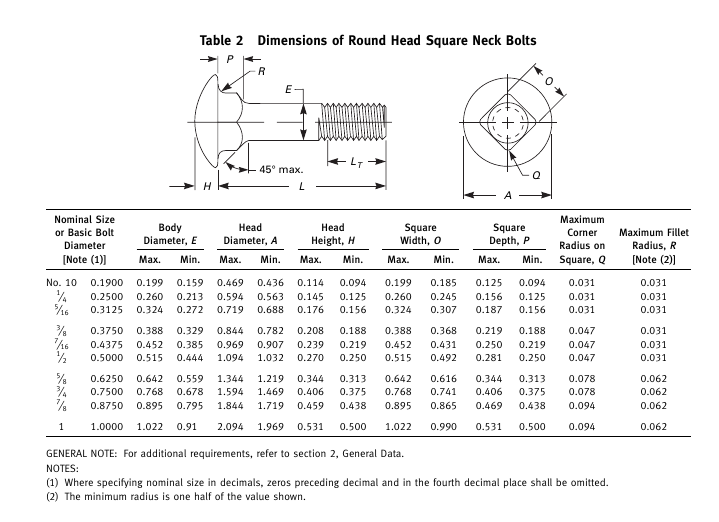

# Contributing to FastenersWB

Table of Contents:

- [Contributing to FastenersWB](#contributing-to-fastenerswb)
- [Adding new fasteners](#adding-new-fasteners)
  - [Creating data files](#creating-data-files)
    - [Converting data to a csv file](#converting-data-to-a-csv-file)
    - [Required files and their purpose](#required-files-and-their-purpose)
  - [writing code to generate the fastener](#writing-code-to-generate-the-fastener)
    - [adding functionality to screw_maker](#adding-functionality-to-screw_maker)
    - [Additional changes](#additional-changes)
    - [Reusing existing code](#reusing-existing-code)
  - [Making icons](#making-icons)
  - [Appendix A - useful resources](#appendix-a---useful-resources)
  - [Appendix B - fasteners to add](#appendix-b---fasteners-to-add)

# Adding new fasteners

This is  a step-by-step guide to adding a new type of screw to FastenersWorkbench.

## Creating data files

The workbench pulls data from `.csv` files, stored in the `FsData` directory.
Let's Implement a new type of fastener - a carriage bolt:



### Converting data to a csv file

The advantage of using the plain text `.csv` format is that there are lots of
tools that work well with these files e.g.:

- [LibreOffice Calc](https://www.libreoffice.org/) or an equivalent spreadsheet editor.
- [GImageReader](https://github.com/manisandro/gImageReader) - for reading text from pdf files
- A text editor with [multi-cursor support](https://code.visualstudio.com/docs/editor/codebasics#_multiple-selections-multicursor)


### Required files and their purpose

We actually need three separate csv files:

- `FsData/{fastenertype}def.csv` - specifies the dimensions of the head of the fastener.
- `FsData/{fastenertype}length.csv` - specifies the discrete fastener lengths that are available for this type of fastener.
- `FsData/{fastenertype}range.csv` - for each available fastener diameter, this file provides the upper and lower bound (inclusive) of lengths that are available.

An example of how this data scheme works in practice:

The first 3 lines of [`FsData/iso7379def.csv`](FsData/iso7379def.csv) are:

```csv
"ISO7379def"
"Dia","P","d1","d3","l2","l3","SW"
"M3",0.5,4,7,7,3,2
```

Note that the line before the table is the table name. It must be the type name appended with "def", "length", etc  
Multiple fastener types can use the same table by adding them above the table. i.e.:
``` csv
"ISO7046range"
"ISO14583range"
"Dia","Min_L","Max_L"
...
```
The first line of the table is a header (it is read into a separate title table `FsTitles`) 
and string values are double quoted. The title name can be arbitrary in most cases but some 
keywords have special meaning
- `csh_diam` : Countersunk-head screw head diameter. If this keyword exists, the automatic screw size detection will be done by this column in the table rather than by stem diameter. This is done because countersunk screw holes are chamfered.
- `csh_height` : Countersunk-head screw head height. If this keyword exists it will be used along with `csh_diam` to automatically chamfer holes for these screw types.
- `thr_len` : Default thread length. For fasteners with arbitrary thread lengths, this will be the default.

For each actual table line:
- The first column is the diameter that the line corresponds to
- The remaining columns are dimensions needed to generate the object 

Most fasteners have special combinations of standard lengths vs standard diameters.
There are 3 ways to store this data:
1. A single length file. First column is the diameter, next columns hold the list of allowed lengths. E.G. :
 ```csv
 "Dia","len","..."
 "M2.5","5","6","7","8","9","10","12","15","17","18","20","25","30"
 "M3","10","15","20","25"
 ```
2. A single range file in the form of`FsData/{fastenertype}range.csv`. The first data line in the table must
 start with the key `all` and holds the list of all possible lengths. All other lines starts with the standard 
 diameter followed by the minimum and maximum lengths for this diameter.
 E.G.: [`PEMFasteners.csv`](FsData/PEMFasteners.csv)
 ```csv
 "PEMStudrange"
 "Dia","Min_L","Max_L"
 "all","6","8","10","12","15","18","20","25","30","35"
 "M2.5","6","18"
 "M3","6","25"
 ...
 ```
3. A combination of length file and range file. The length file, in the form of `FsData/{fastenertype}length.csv`, 
 the first column is the nominal length, and the second and third columns are the minimum and maximum actual 
 lengths permissible when a fastener of that length is manufactured.  
 E.G.: [`iso7379length.csv`](FsData/iso7379length.csv)
 ```csv
 "ISO7379length"
 "Nominal","Min","Max"
 "4",3.76,4.24
 "5",4.76,5.24
 "6",5.76,6.24
 "8",7.71,8.29
 "10",9.71,10.29
 ```
&nbsp;&nbsp;&nbsp;&nbsp;&nbsp;&nbsp;The range file, in the form of `FsData/{fastenertype}range.csv` 
determines which lengths defined in a fasteners' corresponding length file are available for each diameter.
For example, in [`iso7379range.csv`](FsData/iso7379range.csv), we have:
```csv
"ISO7379range"
"Dia","Min_L","Max_L"
"M3","4","30"
"M4","5","40"
"M5","10","80"
"M6","16","100"
```


The files [`iso888length.csv`](FsData/iso888length.csv) and [`inch_fs_length.csv`](FsData/inch_fs_length.csv) provide generalized
length tables that you can use if they work well with the fastener you want 
to implement.


Note that all values are strings, since they correspond to string values
in the `def` and `length` files.

## writing code to generate the fastener

### adding functionality to screw_maker

We will be extending the `Screw` class to generate a new fastener.
To eliminate long `Screw` class code, all fastener generation functions are places in separate files under `FsFunction` directory.
You may either alter existing function if it is similar to the fastener you need, or create a new function.
To create a new function, give it a name in the form of `makeXXXXXXXXX(self)`, and place this function inside a file named `FSmakeXXXXXXXXX.py`. Place this file under `FsFunction` directory. Example:  

[FSmakeCarriageBolt.py](FsFunctions/FSmakeCarriageBolt.py):

```python
def makeCarriageBolt(self, fa): # dynamically loaded method of class Screw
    SType = fa.baseType
    l = fa.calc_len
    d = self.getDia(fa.calc_diam, False)
    if SType == 'ASMEB18.5.2':
        tpi, _, A, H, O, P, _, _ = fa.dimTable
        A, H, O, P = (25.4 * x for x in (A, H, O, P))
        pitch = 25.4 / tpi
        if l <= 152.4:
            L_t = d * 2 + 6.35
        else:
            L_t = d * 2 + 12.7
        
    head_r = A / sqrt2
    flat_len = l - P

    # create a profile for head generation. Basially when this profile revolves we get the head solid
    # FSFaceMaker is a nice helper to build a profile from lines and arcs it make a profile on the x,z plane
    fm = FastenerBase.FSFaceMaker()
    fm.AddPoint(0, H)
    # arcs are 3 point arcs where the first point is the last one added 
    fm.AddArc(head_r * sin22_5, H - head_r + head_r * cos22_5, A / 2, 0)
    fm.AddPoint(sqrt2 / 2 * O, 0)
    fm.AddPoint(sqrt2 / 2 * O, -1 * P + (sqrt2 / 2 * O - d / 2))
    fm.AddPoint(d / 2, -1 * P)
    wire1 = fm.GetWire()
    head_shell = self.RevolveZ(wire1)
    if not fa.Thread:
        # simplified threaded section
        fm.Reset()
        fm.AddPoint(d / 2, -1 * P)
        if (flat_len > L_t):
            fm.AddPoint(d / 2, -l + L_t)
        fm.AddPoint(d / 2, -l + d / 10)
        fm.AddPoint(d / 2 - d / 10, -l)
        fm.AddPoint(0, -l)
        thread_profile_wire = fm.GetWire()
        shell_thread = self.RevolveZ(thread_profile_wire)
    else:
        # modeled threaded section
        shell_thread = self.makeShellthread(d, pitch, flat_len, False, -P, L_t)
    p_shell = Part.Shell(head_shell.Faces + shell_thread.Faces)
    p_solid = Part.Solid(p_shell)
    # cut 4 flats under the head
    d_mod = d + 0.0002
    outerBox = Part.makeBox(A * 4, A * 4, P + 0.0001, Base.Vector(-A * 2, -A * 2, -P + 0.0001))
    innerBox = Part.makeBox(d_mod, d_mod, P * 3, Base.Vector(-d_mod / 2, -d_mod / 2, -P * 2))
    tool = outerBox.cut(innerBox)
    p_solid = p_solid.cut(tool)
    return p_solid
```

FreeCAD's `Part` Module works somewhat like a clunkier version of OpenSCAD.
We lay out points and build them up into 3D shells, then merge them together
to return a solid object. The call to `makeShellthread` returns a modelled 
thread as a shell. Remember that `Part.Show(object)` will show `object` in 
the current FreeCAD document. This function gives us an equivalent to print
debugging. 


You can review the code added to `screw_maker.py` for this example
[HERE](https://github.com/shaise/FreeCAD_FastenersWB/commit/a60aa6a84a06ebd08072ad8e7e08d35095885f9f#diff-1714d1d791cb4949f7c3d13e84a426e4037bb68c9ed1a1da7623e6e5b97fa9b3).

### Additional changes

`ScrewMaker.py` needs an entry added to the `screwTables` variable to match our added fastener

```python
screwTables = {
  ...
  'ASMEB18.5.2': ("Screw", -1, 0, "makeCarriageBolt"),
  ...
}
```

Check out the corresponding commit [HERE](https://github.com/shaise/FreeCAD_FastenersWB/commit/a60aa6a84a06ebd08072ad8e7e08d35095885f9f#diff-7500edada7f01d372094af6412f7926a5f9925d65ed9fae3da8335aa493ea1a7).

- `FastenersCmd.py` needs a line to initialize a new toolbar command for the workbench.
 Add a line to `FSScrewCommandTable`:

```python
    "ASMEB18.5.2": ("ASME B18.5 UNC Round head square neck bolts", "Other head", ScrewParameters)
```
Explanation: 
* 1st arg is the **fastener description**  
* 2nd arg is the **fastener group** (fasteners in the same group are interchangeable using the `type` property)  
* 3rd arg is the **list of properties** the fastener uses  


**Note:** For reference, check out the corresponding source code [commit](https://github.com/shaise/FreeCAD_FastenersWB/commit/a60aa6a84a06ebd08072ad8e7e08d35095885f9f#diff-964aeb21792025cecf1c3e54451f5102de16b71312d66ff5d442ca5a63b82d13).

#### Adding a new type of fastener

When adding a new type of fastener you need to make sure to do this additional changes.

On `FastenersCmd.py` file:

- Add entries to translate the new type name
- Add a set of parameters, these parameters will be available for the user on the property view on FreeCAD GUI.
- Add the new type of fastener

```python
translate("FastenerCmdTreeView", "RetainingRing")
...
RetainingRingParameters = {"type", "diameter", "MatchOuter"}
...
RetainingRingGroup = translate("FastenerCmd", "Retaining Rings")
...
FastenerBase.FSAddFastenerType("RetainingRing", False)
```

- You may need to make additional changes on `ScrewMaker.py` file.
- On `FsFunctions` directory add the new python file(s) that create the geometry of the fastener.
- In `FastenersBase.py` file on `FsMakeBomCommand` class add a new method to be able to add the fasteners to the BOM. Make sure that the method's name match the name of the type on `screwTables` dict.

```python
    def AddRetainingRing(self, obj, cnt):
        self.AddFastener(obj.type + translate("FastenerBase", " Retaining Ring ") + obj.Diameter, cnt)
```

**NOTE:** For reference, check out this [pull request](https://github.com/shaise/FreeCAD_FastenersWB/pull/222/files) to get a good idea on how to do it.

### Reusing existing code

The `screw_maker.Screw` class generally has one method to create a 
particular type of fastener. That code can then be reused to create 
multiple similar parts. See the following snippet :

```python
  # also used for ISO 7046 countersunk flat head screws with H cross recess
  # also used for ISO 7047 raised countersunk head screws with H cross recess
  # also used for ISO 10642 Hexagon socket countersunk head screws
  # also used for ISO 14582 Hexalobular socket countersunk head screws, high head
  # also used for ISO 14584 Hexalobular socket raised countersunk head screws
  def makePanHeadScrew(self):
    ...
```

If you choose to reuse an existing method, you must determine which dimensions
it uses to generate a shape. This can usually be accomplished by looking 
at standards tables for parts the method already implements, or measuring
existing fasteners in FreeCAD.

### Reusing code for identical fasteners on different standards
In the case you want to add a new fastener that is identical to an existing fastener but with different name (i.e. ISO299 is identical to existing DIN508), Do the following:
- on `FastenersCmd.py` in `FSScrewCommandTable` table add an apropriate line.
- on `FSAliases.py` add an entry to both `FSIconAliases` and `FSTypeAliases` tables. The key is the new fastener, and the data is the existing identical fastener.

## Making icons

Dust off your graphic design skills.

The easiest way to create an icon for your new fastener type is as follows:
- Create a TechDraw view of the fastener from a close-to-isometric view angle
- Right click on the fastener view and select `Export DXF` and import it into Inkscape. Note: `Export DXF` output is cleaner than `Export SVG`.
- Select all paths and use `Path>Combine` tool, `Ctrl+K`
- In the `Layers and Objects` tab right click on the resultant path and duplicate it, `Ctrl+D`
- On the first path set:
  - the `Fill` to "No paint"
  - the `Stroke paint` to "Flat color" and to black, `#000000` 
  - the `Stroke style` width to be around 1.26px
- On the second path:
  - Use `Path>Stroke to Path` tool, `Ctrl+Alt+C`
  - With the `Node Tool (N)` remove the internal nodes that create "holes" in the path
  - Once it's done, recolor the path, set:
    - the `Fill` to "Flat color" and
      - use `#FFAF00`  for metric fasteners
      - use `#5FD3C2`  for imperial fasteners
    - the `Stroke paint` to "No paint"
- Use `Path>Simplify` tool, `Ctrl+L` as needed
- Leave a margin of 2 pixels on 4 sides and fit the fastener icon inside the margin.
- Icons should be **48x48px plain svg files**, on Inkscape set: `File>Document Properties>Display>Front Page>Format:` to `Icon 48x48`
- Also set scale to one on: `File>Document Properties>Display>Front Page>Scale:` to `1.00000`
- You can set the title in: `File>Document Properties>Metadata/Title`
- To save the file use `File>Save as...` and choose either "Plain SVG" or "Optimized SVG"


### Reusing an icon

If you want to use an existing icon for a new fastener, add an entry into `FSIconAliases` table located at `FSAliases.py`.  The key is the new fastener, and the data is the fastener who's icon is to be used.
 

## Appendix A - useful resources

Some websites that provide free-to-view data on standard fasteners:

- [https://www.fasteners.eu/](https://www.fasteners.eu/)
- [https://torqbolt.com/](https://torqbolt.com/)
- [https://www.mcmaster.com/](https://www.mcmaster.com/)

## Appendix B - fasteners to add

[ISO standards related to fasteners](https://www.iso.org/ics/21.060/x/)

ASME standards related to fasteners:

|Item | Standard |
|-----|----------|
| Small Solid Rivets | B18.1.1-1972(R2006) |
| Large Rivets | B18.1.2-1972(R2006) |
| Metric Small Solid Rivets | B18.1.3M-1983(R2006) |
| Square and Hex Bolts and Screws (Inch Series) | B18.2.1-1996(R2005) |
| Square and Hex Nuts (Inch Series) | B18.2.2-1987(R2005) |
| Metric Hex Cap Screws | B18.2.3.1M-1999(R2005) |
| Metric Formed Hex Screws | B18.2.3.2M-2005 |
| Metric Heavy Hex Screws | B18.2.3.3M-1979(R2001) |
| Metric Hex Flange Screws | B18.2.3.4M-2001(R2006) |
| Metric Hex Bolts | B18.2.3.5M-1979(R2006) |
| Metric Heavy Hex Bolts | B18.2.3.6M-1979(R2006) |
| Metric Heavy Hex Structural Bolts | B18.2.3.7M-1979(R2006) |
| Metric Hex Lag Screws | B18.2.3.8M-1981(R2005) |
| Metric Heavy Hex Flange Screws | B18.2.3.9M-2001(R2006) |
| Square Head Bolts (Metric Series) | B18.2.3.10M-1996(R2003) |
| Metric Hex Nuts,Style1 | B18.2.4.1M-2002(R2007) |
| Metric Hex Nuts,Style2 | B18.2.4.2M-2005 |
| Metric Slotted Hex Nuts | B18.2.4.3M-1979(R2006) |
| Metric Hex Flange Nuts | B18.2.4.4M-1982(R2005) |
| Metric Hex Jam Nuts | B18.2.4.5M-1979(R2003) |
| Metric Heavy Hex Nuts | B18.2.4.6M-1979(R2003) |
| Fasteners for Use in Structural Applications | B18.2.6-2006 |
| Metric12-Spline Flange Screws | B18.2.7.1M-2002(R2007) |
| Clearance Holes for Bolt,Screws,and Studs | B18.2.8-1999(R2005) |
| Straightness Gage and Gaging for Bolts and Screws | B18.2.9-2007 |
| Socket Cap,Shoulder,and Set Screws,Hex and Spline Keys (Inch Series) | B18.3-2003(R2008) |
| Socket Head Cap Screws (Metric Series) | B18.3.1M-1986(R2008) |
| Metric Series Hexagon Keys and Bits | B18.3.2M-1979(R2008) |
| Hexagon Socket Head Shoulder Screws (Metric Series) | B18.3.3M-1986(R2008) |
| Hexagon Socket Button Head Cap Screws (Metric Series) | B18.3.4M-1986(R2008) |
| Hexagon Socket Flat Countersunk Head Cap Screws (Metric Series) | B18.3.5M-1986(R2008) |
| Metric Series Socket Set Screws | B18.3.6M-1986(R2008) |
| Round Head Bolts (Inch Series) | B18.5-1990(R2003) |
| Metric Round Head Short Square Neck Bolts | B18.5.2.1M-2006 |
| Metric Round Head Square Neck Bolts | B18.5.2.2M-1982(R2005) |
| Round Head Square Neck Bolts With Large Head (Metric Series) | B18.5.2.3M-1990(R2003) |
| Wood Screws (Inch Series) | B18.6.1-1981(R2008) |
| Slotted Head Cap Screws,Square Head Set Screws,and Slotted Headless Set Screws (Inch Series) | B18.6.2-1998(R2005) |
| Machine Screws and Machine Screw Nuts | B18.6.3-2003(R2008) |
| Thread Forming and Thread Cutting Tapping Screws and Metallic Drive Screws (Inch Series) | B18.6.4-1998(R2005) |
| Metric Thread-Forming and Thread-Cutting Tapping Screws | B18.6.5M-2000(R2005) |
| Metric Machine Screws | B18.6.7M-1999(R2005) |
| General Purpose Semi-Tubular Rivets,Full Tubular Rivets,Split Rivets and Rivet Caps | B18.7-2007 |
| Metric General Purpose Semi-Tubular Rivets | B18.7.1M-2007 |
| Clevis Pins and Cotter Pins (Inch Series) | B18.8.1-1994(R2000) |
| Taper Pins,Dowel Pins,Straight Pins,Grooved Pins,and Spring Pins (Inch Series) | B18.8.2-2000 |
| Spring Pins:Coiled Type,Spring Pins:Slotted,Machine Dowel Pins:Hardened Ground,and Grooved Pins (Metric Series) | B18.8.100M-2000(R2005) |
| Cotter Pins,Headless Clevis Pins,and Headed Clevis Pins (Metric Series) | B18.8.200M-2000(R2005) |
| Plow Bolts | B18.9-2007 |
| Track Bolts and Nuts | B18.10-1982(R2005) |
| Miniature Screws | B18.11-1961(R2005) |
| Glossary of Terms for Mechanical Fasteners | B18.12-2001(R2006) |
| Screw and Washer Assemblies—Sems (Inch Series) | B18.13-1996(R2003) |
| Screw and Washer Assemblies:Sems (Metric Series) | B18.13.1M-1998(R2003) |
| Forged Eyebolts | B18.15-1985(R2003) |
| Metric Lifting Eyes | B18.15M-1998(R2004) |
| Prevailing-Torque Type Steel Metric Hex Nuts and Hex Flange Nuts | B18.16M-2004 |
| Serrated Hex Flange Locknuts90,000psi (Inch Series) | B18.16.4-2008 |
| Nylon Insert Locknuts (Inch Series) | B18.16.6-2008 |
| Inspection and Quality Assurance for General Purpose Fasteners | B18.18.1-2007 |
| Inspection and Quality Assurance for High-Volume Machine Assembly Fasteners | B18.18.2M-1987(R2005) |
| Inspection and Quality Assurance for Special Purpose Fasteners | B18.18.3M-1987(R2005) |
| Inspection and Quality Assurance for Fasteners for Highly Specialized Engineered Applications | B18.18.4M-1987(R2005) |
| Inspection and Quality Assurance Plan Requiring In-Process Inspection and Controls | B18.18.5M-1998(R2003) |
| Quality Assurance Plan for Fasteners Produced in a Third Party Accreditation System | B18.18.6M-1998(R2003) |
| Quality Assurance Plan for Fasteners Produced in a Customer Approved Control Plan | B18.18.7M-1998(R2003) |
| Lock Washers (Inch Series) | B18.21.1-1999(R2005) |
| Lock Washers (Metric Series) | B18.21.2M-1999(R2005) |
| Double Coil Helical Spring Lock Washers for Wood Structures | B18.21.3-2008 |
| Metric Plain Washers | B18.22M-1981(R2005) |
| Plain Washers | B18.22.1-1965(R2003) |
| Part Identifying Number (PIN)Code System for B18Fastener Products | B18.24-2004 |
| Square and Rectangular Keys and Keyways | B18.25.1M-1996(R2003) |
| Woodruff Keys and Keyways | B18.25.2M-1996(R2003) |
| Square and Rectangular Keys and Keyways:Width Tolerances and |
| Deviations Greater Than Basic Size | B18.25.3M-1998(R2003) |
| Tapered and Reduced Cross Section Retaining Rings (Inch Series) | B18.27-1998(R2005) |
| Helical Coil Screw Thread Inserts—Free Running and Screw Locking (Inch Series) | B18.29.1-1993(R2007) |
| Helical Coil Screw Thread Inserts:Free Running and Screw Locking (Metric Series) | B18.29.2M-2005 |
| Open-End Blind Rivets With Break Mandrels (Metric Series) | B18.30.1M-2000(R2005) |
| Metric Continuous and Double-End Studs | B18.31.1M-2008 |
