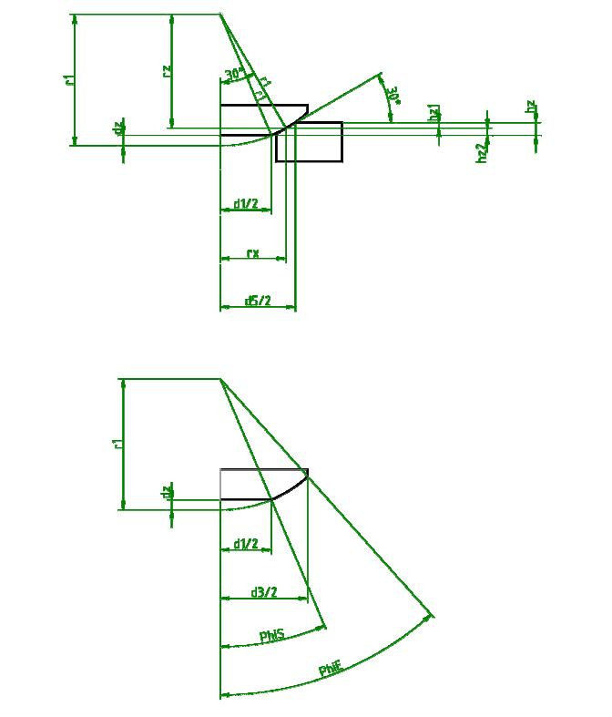

# DIN 6319 Calculation Overlap

## Sketch



## Solution

The following python code can be used to determine Hz:

``` python
from sympy import *

vars = d1, d5, dz, hz, hz1, hz2, r1, rx, rz = symbols(
    "d1, d5, dz, hz, hz1, hz2, r1, rx, rz"
)
print(f"Variables:\n{vars}\n")
equations = [
    Eq(hz, hz1 + hz2),
    Eq(tan(pi / 6), hz1 / (d5 / 2 - rx)),
    Eq(tan(pi / 6), rx / rz),
    Eq(r1, rz + hz2 + dz),
    Eq(sin(pi / 6), rx / r1),
    Eq(r1**2, (d1 / 2) ** 2 + (r1 - dz) ** 2),
]
print("Equations:")
for e in equations:
    print(e)
print("\nGeneral Solution for Hz:")
values = solve([*equations], (dz, hz, hz1, hz2, rx, rz), dict=True)[0]
print(f"hz={values[hz]}")
# known values for size M20
known_values = [Eq(d1, 21), Eq(d5, 31), Eq(r1, 27)]
print("\nKnown:")
for e in known_values:
    print(e)
values = solve([*equations, *known_values], vars, dict=True)[0]
print(f"\nResults:\nhz={values[hz].n()}")
```

This produces:
``` python
Variables:
(d1, d5, dz, hz, hz1, hz2, r1, rx, rz)

Equations:
Eq(hz, hz1 + hz2)
Eq(sqrt(3)/3, hz1/(d5/2 - rx))
Eq(sqrt(3)/3, rx/rz)
Eq(r1, dz + hz2 + rz)
Eq(1/2, rx/r1)
Eq(r1**2, d1**2/4 + (-dz + r1)**2)

General Solution for Hz:
hz=sqrt(3)*d5/6 - 2*sqrt(3)*r1/3 + sqrt(-d1**2 + 4*r1**2)/2

Known:
Eq(d1, 21)
Eq(d5, 31)
Eq(r1, 27)

Results:
hz=2.64670056386491
```
