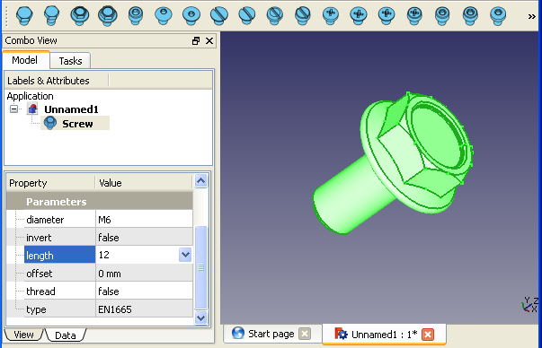
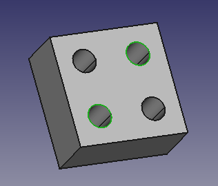
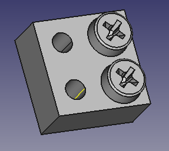

# FreeCAD Fasteners Workbench
[](https://lgtm.com/projects/g/shaise/FreeCAD_FastenersWB/alerts/) [](https://lgtm.com/projects/g/shaise/FreeCAD_FastenersWB/context:python)  

A FreeCAD Workbench to Add/Attach various Fasteners to Parts  


**Note:** This workbench acts as a wrapper to the `screw_maker macro` created by [@ulrich1a](https://github.com/ulrich1a)


### Installation

#### Addon Manager
**Note:** Starting from FreeCAD v0.17.9940 an Addons Manager has been built-in to FreeCAD.  
You can use said [Addon Manager](https://github.com/FreeCAD/FreeCAD-addons/#1-builtin-addon-manager) to seamlessly install Fasteners Workbench.

#### Manual Installation
For versions prior to v0.17.9940 FreeCAD requires manual installation, learn how via http://theseger.com/projects/2015/06/fasteners-workbench-for-freecad/


## Usage

<details>
  <summary><i>Expand this section for a synopsis on how to use this workbench</i></summary> 

**Note:** this info is also available on http://theseger.com/projects/2015/06/fasteners-workbench-for-freecad/

### Where to Start

Usage is pretty straightforward:  
1. Install the workbench and restart FreeCAD
2. Open a new document in FreeCAD 
3. Select the Fasteners workbench from the workbench drop-down list  
Result: A series of screws will show on the toolbar:  

    

4. Clicking on any of the screws will create this screw in the origin position with default size.  

5. To change size/length: select the newly created screw, then go to the data tab in the property panel, there you can change diameter and length. (For now it is in metric standard):  

  

6. Changing the “thread” property to “true” will render the screw threads as well.  
 **Please note:**  
    * generating threads takes considerable amount of time, during which, FreeCAD will not be responsive.
    * the invert and offset properties are only applicable to attached fasteners.

### Attached Fasteners

Fasteners can also be attached to features in other parts. 

#### Attach Screw to part

* To attach a screw to a part, the part must have features with circular edges, such as holes.   

#### Attach Screw to hole(s)
* To attach screws to holes, select the desired circular edge or several edges (You can also select a face if you want to select all holes in that face):

  

*  Now click on the desired screw.  
  **Result:** A screw will be placed on each of the selected features, trying to match the screw size to the hole size:

  

* You can now, like before, change diameter and length from the properties panel. 

* If you wish the screw to hover above the hole, you can set the “offset” property  to the desired distance.  
  **Note:** Sometimes the screw does not detect the direction correctly and appears upside down.  
  To correct this change the “invert” property to true OR select the screw and press the Flip button:  
   in the toolbar.

#### Attach Fastener to different feature

* To attach an existing fastener to a different feature, select the screw, then ctrl-select the new feature:

  

* Now press the Move button  in the toolbar

* **Result:** The screw will move to the new location:  

  

  * **Note:** An attached screw will move with the part it is attached to.  
    **If you wish to detach the screw from the parent part**:  
    * simply select only the screw  
    * then press the move button.  
    ***Result:** the screw is now detached and can be moved individually.

### Simplifying objects

**Important Note:** If you wish to share FCStd files that contains fasteners (or parts from other custom parametric workbenches)  with other people, they must install these workbenches as well, or else they will get errors when trying to use them.

**However**, if you just want to share the resulting parts, with no need to change object’s parameters, you can use the **Simplify** function  to convert the fasteners to simple shapes.  

**Result:** They will appear as new Shape parts in the model tree. You can then delete the original fasteners and save as a simple FCStd that can be read and used on any FreeCAD installation.


### Adding Fasteners via Python

You can create screws with a script using the `createFastener` command:
```python
createFastener(type, diam, len, threadType, shapeOnly = False)
```
`threadType` can be `'simple'` or `'real`  
`shapeOnly` can be **True** if you just want to get the object or **False** (default) if you want it to be added to the treeView and shown.
```python
import ScrewMaker
sm = ScrewMaker.Instance()
screwobj = sm.createFastener('ISO7046', 'M6', '8', 'simple')
```

</details>

#### Note for FreeCAD 0.17 Part Design:
~~To attach a fastener to a feature created with part design, it must be attached to the body, rather then one of its inner elements. To do so, first switch the "Display Mode" of the body from "Through" to "Tip". This can be found in the "View" tab of the Body's properties panel. To continue editing the Body, switch back to "Through"~~  
**This is now done automatically**

#### Release Notes
* V0.3.13  20 Feb 2020:  Add DIN 7984 screws, Thank you @Berberic2 !
* V0.3.12  16 Feb 2020:  Support multiple arrays and links when counting BOM
* V0.3.11  02 Jan 2020:  Take arrays into account when creating BOM. 
* V0.3.10  25 Jan 2019:  Added 3D printer compatible thread generation.  
* V0.3.02  14 Jan 2019:  Fix hole matching bug  
* V0.3.01  28 Dec 2018:  Fix ISO4762 M4x10 generation issue (occ7.2).  
* V0.3.00  03 Sep 2018:  Make WB compatible with Python 3 and Qt 5  
* V0.2.19  22 Aug 2018:  Add DIN 985 - Nyloc nuts. issue #27  
* V0.2.18  13 Aug 2018:  Fix ISO10642 & ISO14584 issues on v0.18. issue #25  
* V0.2.17  13 Jul 2018:  Fix Bug: selecting a face to select all holes did not work.  
* V0.2.16  01 May 2018:  Attaching to PartDesign features redirect the attachment to the parent body  
* V0.2.15  25 Apr 2018:  Add DIN 562 and DIN 557 square nuts  
* V0.2.14  19 Jun 2017:  Fix countersunk function bug. Merge Maurice's fix for screw generation  
* V0.2.13  01 Oct 2015:  Add generation of BOM  
* V0.2.11  24 Aug 2015:  Add inner/outer match attribute to screws. Fix several bugs  
* V0.2.10  23 Aug 2015:  Add new command: Batch change fasteners parameters  
* V0.2.09  23 Aug 2015:  Fixed screw creation bug when not attached to geometry  
* V0.2.08  06 Aug 2015:  Add threaded rod item. Fix loading issue  
* V0.2.07  05 Aug 2015:  Add option to select auto crew diameter matching method:  
                         by inner or outer thread diameter  
* V0.2.06  02 Aug 2015:  Added hole diameter calculator helper.  
* V0.2.05  01 Aug 2015:  Option to select type of screw for countersunk holes.  
* V0.2.03  30 Jul 2015:  Separate option for grouping icons as toolbars or as drop-down buttons  
* V0.2.01  28 Jul 2015:  Update to Ulrich's V2.0 screw maker. many more screws, and nuts with threads!  
* V0.1.04  21 Jul 2015:  Drop-down buttons can be enabled in Preferences under Fasteners.  
* V0.1.03  15 Jul 2015:  Disable drop-down buttons. It will be used only when screw items count will be too big.  
* V0.1.02  14 Jul 2015:  Group screws in drop-down buttons (works for FreeCAD 0.16 and up)  
* V0.1.01  13 Jul 2015:  Add a command to make recessed holes for countersunk screws.  
* V0.0.10  29 Jun 2015:  Add PEM Metric Studs.  
* V0.0.09  28 Jun 2015:  Selecting a face will put a fastener in all holes in that face.  
                         Caching of fasteners speed up generation of same shape ones  
* V0.0.08  27 Jun 2015:  Edge selection over multiple objects when generating fasteners now works.  
* V0.0.07  26 Jun 2015:  Add PEM Standoffs  
* V0.0.06  25 Jun 2015:  Show only applicable M values and lengths, add descriptive name  
* V0.0.05  24 Jun 2015:  Add simplify object function, Change icon colors  
* V0.0.04  23 Jun 2015:  Add ISO 4032 Metric Hex Nut  
* V0.0.03  21 Jun 2015:  Add PEM Metric Press-Nut (Self clinching nut)  
* V0.0.02  18 Jun 2015:  Save/Load issue fixed  
* V0.0.01  18 Jun 2015:  Initial version  


#### Developers
* ScrewMaker: Ulrich Brammer <ulrich1a[at]users.sourceforge.net> [@ulrich1a](https://github.com/ulrich1a)  
* Workbench wrapper:  Shai Seger [@shaise](https://github.com/shaise)

### Feedback
For further discussion, feel free to open a forum thread on [FreeCAD Open Discussion subforum](https://forum.freecadweb.org/viewforum.php?f=8&sid=853eff68d2a09bfd39fb3508d038af97) and make sure to ping user 'shaise'.  

There is also an [ongoing thread](https://forum.freecadweb.org/viewtopic.php?f=8&t=114290) discussing Fasteners Workbench that is also a place to comment on.

### License
GPLv2
