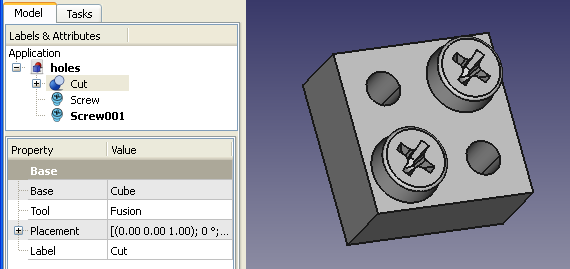

# FreeCAD Fasteners Workbench

[](https://www.python.org/dev/peps/pep-0008/)

A FreeCAD Workbench to Add/Attach various Fasteners to Parts  


**Note:** This workbench acts as a wrapper to the `screw_maker macro` created by [@ulrich1a](https://github.com/ulrich1a)


### Installation

#### Addon Manager
**Note:** Starting from FreeCAD v0.17.9940 an Addons Manager has been built-in to FreeCAD.  
You can use said [Addon Manager](https://github.com/FreeCAD/FreeCAD-addons/#1-builtin-addon-manager) to seamlessly install Fasteners Workbench.

#### Manual Installation
For versions prior to v0.17.9940 FreeCAD requires manual installation, learn how via http://theseger.com/projects/2015/06/fasteners-workbench-for-freecad/


## Usage
### Official Wiki
https://www.freecadweb.org/wiki/Fasteners_Workbench  
 
<details>
  <summary><i>Expand this section for a synopsis on how to use this workbench</i></summary> 

**Note:** this info is also available on http://theseger.com/projects/2015/06/fasteners-workbench-for-freecad/

### Where to Start

Usage is pretty straightforward:  
1. Install the workbench and restart FreeCAD
2. Open a new document in FreeCAD 
3. Select the Fasteners workbench from the workbench drop-down list  
Result: A series of screws will show on the toolbar:  

    

4. Clicking on any of the screws will create this screw in the origin position with default size.  

5. To change size/length: select the newly created screw, then go to the data tab in the property panel, there you can change diameter and length. (For now it is in metric standard):  

  

6. Changing the “thread” property to “true” will render the screw threads as well.  
 **Please note:**  
    * generating threads takes considerable amount of time, during which, FreeCAD will not be responsive.
    * the invert and offset properties are only applicable to attached fasteners.

### Attached Fasteners

Fasteners can also be attached to features in other parts. 

#### Attach Screw to part

* To attach a screw to a part, the part must have features with circular edges, such as holes.   

#### Attach Screw to hole(s)
* To attach screws to holes, select the desired circular edge or several edges (You can also select a face if you want to select all holes in that face):

  

*  Now click on the desired screw.  
  **Result:** A screw will be placed on each of the selected features, trying to match the screw size to the hole size:

  

* You can now, like before, change diameter and length from the properties panel. 

* If you wish the screw to hover above the hole, you can set the “offset” property  to the desired distance.  
  **Note:** Sometimes the screw does not detect the direction correctly and appears upside down.  
  To correct this change the “invert” property to true OR select the screw and press the Flip button:  
   in the toolbar.

#### Attach Fastener to different feature

* To attach an existing fastener to a different feature, select the screw, then ctrl-select the new feature:

  

* Now press the Move button  in the toolbar

* **Result:** The screw will move to the new location:  

  

  * **Note:** An attached screw will move with the part it is attached to.  
    **If you wish to detach the screw from the parent part**:  
    * simply select only the screw  
    * then press the move button.  
    ***Result:** the screw is now detached and can be moved individually.

### Simplifying objects

**Important Note:** If you wish to share FCStd files that contains fasteners (or parts from other custom parametric workbenches)  with other people, they must install these workbenches as well, or else they will get errors when trying to use them.

**However**, if you just want to share the resulting parts, with no need to change object’s parameters, you can use the **Simplify** function  to convert the fasteners to simple shapes.  

**Result:** They will appear as new Shape parts in the model tree. You can then delete the original fasteners and save as a simple FCStd that can be read and used on any FreeCAD installation.


### Adding Fasteners via Python

You can create screws with a script using the `createFastener` command:
```python
createFastener(type, diam, len, threadType, shapeOnly = False)
```
`threadType` can be `'simple'` or `'real`  
`shapeOnly` can be **True** if you just want to get the object or **False** (default) if you want it to be added to the treeView and shown.
```python
import ScrewMaker
sm = ScrewMaker.Instance
screwobj = sm.createFastener('ISO7046', 'M6', '8', 'simple')
```

</details>

#### Release Notes
* V0.5.24  19 Jun 2024:  Change all property names to Title Case.
* V0.5.23  17 Jun 2024:  Fix error when changing length of threaded rod in change ui.
* V0.5.22  08 Jun 2024:  Fix regular expression issue.
                       - Fix error when loading 'change parameters' UI.  
* V0.5.21  14 May 2024:  Fix typos by @berberic2.  
                       - Improve autogenerated names for T-slot-nuts by @berberic2.  
                       - Improve slot generation for screw heads by @Syres916.  
                       - Fix GN505.4 fastener type by @berberic2.  
                       - Fix fastener shape for GN 506 T-Slot nut by @berberic2.  
* V0.5.20  26 Apr 2024:  Fix Bom bug by @Syres916.  
                       - Remove redundant casts for better compatibility by @YakoYakoYokuYoku.  
* V0.5.19  17 Apr 2024:  Add ISO 14581 by @Roundwolf.  
* V0.5.18  14 Apr 2024:  Update icons by @maxwxyz.  
                       - typo fixes by @Roy-043  
* V0.5.17  08 Apr 2024:  Add option to set fasteners default line and point size.  
* V0.5.16  05 Apr 2024:  Add option to set fasteners default color.  
* V0.5.15  30 Mar 2024:  Fasteners logo to comply with freecad's guidlines.  
* V0.5.14  10 Mar 2024:  Add more nails & thumb screws by @hasecilu:  
                       -  DIN 464, DIN 465 and DIN 653 Thumb screws  
                       -  DIN 1143, DIN 1144A, DIN 1151A, DIN 1151B and DIN1152 nails  
                       - Update function names by @hasecilu.  
* V0.5.13  03 Mar 2024:  Deprecate countersunk hole feature by @alexneufeld.  
                       - Update translation script by @hasecilu.  
                       - Restore missing ASMEB18.2.1.6 fastener by @hasecilu.  
* V0.5.12  21 Feb 2024:  Add remaining unimplemented ISO hex head fasteners by @alexneufeld:  
                       -  ISO 4015, ISO 4016, ISO 4018, ISO 4162, ISO 8765, ISO 15071 and ISO 15072.  
* V0.5.11  19 Feb 2024:  Add ISO 2342 headless screws by @alexneufeld.  
                       - Add remaining unimplemented ISO nuts by @alexneufeld:  
                       - ISO 4161, ISO 7040, ISO 7041, ISO 7043, ISO 7044, ISO 7719, ISO 7720, ISO 10511,  
                       - ISO 10512, ISO 10513, ISO 10663, ISO 12125, ISO 12126 and ISO 21670.  
* V0.5.10  13 Feb 2024:  Add ASMEB18.6.1 wood screws by @cfunseth.  
                       - Add lots of metric pin types by @alexneufeld:  
                       -  ISO1234, ISO2338, ISO2339, ISO2340A, ISO2340B, ISO2341A, ISO2341B, ISO8733  
                       -  ISO8734, ISO8735, ISO8736, ISO8737, ISO8739, ISO8740, ISO8741, ISO8742,  
                       -  ISO8743, ISO8744, ISO8745, ISO8746, ISO8747, ISO8748, ISO8750, ISO8751,  
                       -  ISO8752 and ISO13337.  
                       - Merge def files to reduce load
* V0.5.03  10 Feb 2024:  Add remaining ASME B18.6.3 fasteners by @cfunseth.  
* V0.5.02  07 Feb 2024:  Add DIN1160 nails by @hasecilu.  
                       - Code fixes and cleanup by @hasecilu.   
* V0.5.01  05 Feb 2024:  updated german translation by @berberic2.  
                       - Screw Table sorting by @tobiasfalk.   
                       - DIN1624 renaming to 4 Prong Wood Thread Insert by @tobiasfalk.   
                       - Add ASME B18.6.3 1B & 4A @cfunseth.   
* V0.5.00  12 Jan 2024:  Lots of improvements by @hasecilu:  
                       - Add ISO1478: Self tapping screw thread  
                       - Add ISO7049: cross-recessed pan head tapping screws  
                       - Add ISO 68-1 & 2 thread dimensions  
                       - Add ISO 262:  metric pitch table  
                       - Add GN 506: T-slot nut to swivel in with ball spring  
                       - Add ISO 2936: Hex key  
                       - bug fixes  
                       - code refacroting and cleanup  
* V0.4.75  16 Dec 2023:  Update Spanish translations by @hasecilu.  
                       - fix aliased issue with bom generation.  
* V0.4.74  16 Dec 2023:  Add ISO8738, plain washers for clevis pins by @hasecilu.  
                       - automatically add aliasses to screwTables  
* V0.4.73  15 Dec 2023:  Add ISO4034 nut by @hasecilu.  
                       - Add DIN6319 type C, D and G - Spherical Washers - Conical Seats by @UR-0.
                       - Add alias support for equivalent fasteners 
* V0.4.72  10 Dec 2023:  Update Polish translations by @kaktusus.  
* V0.4.71  26 Nov 2023:  Add DIN6331 Hexagon nuts with collar by @UR-0.  
                       - Fix M6 pitch for DIN6330 by @UR-0.  
* V0.4.70  02 Nov 2023:  Add custom length and width for heatset inserts.  
* V0.4.69  01 Nov 2023:  Use the new loads/dumps system (supporting old versions as well) by @fra589.  
* V0.4.68  29 Oct 2023:  Import translate module direcrtly by @Roy-043.  
* V0.4.67  15 Sep 2023:  Fix screw die tool.  
* V0.4.66  12 Sep 2023:  Update and add T slot fasteners by @hasecilu.  
                       - Update Spanish translations by @hasecilu.  
                       - German translation update + update.sh change by @berberic2.  
                       - PEM Inserts → Inserts by @berberic2.  
                       - Added some whitespace to get uniform appearance by @UR-0.  
* V0.4.65  06 Sep 2023:  Added DIN 961, ISO 8676, ISO 8673, ISO 8674 and ISO 8675 by @tobiasfalk.  
* V0.4.64  05 Sep 2023:  Update french translation files by @kaktusus & @David69.  
                       - Add German translations by @berberic2  
* V0.4.63  30 Aug 2023:  Add french translation files by @kaktusus & @David69.  
* V0.4.62  23 Aug 2023:  Add polish translation files by @kaktusus.  
* V0.4.61  22 Aug 2023:  Add preferences to select which fastener types to show by @alexneufeld.  
                       - Non selected standards stil shows on the menu bar. 
* V0.4.60  16 Aug 2023:  Add DIN 6330 Nuts by @berberic2.  
* V0.4.59  30 Jul 2023:  Add DIN 6340 Washers by @berberic2.  
* V0.4.58  23 Jul 2023:  Add DIN 7996 wood screws by @berberic2.  
* V0.4.57  21 Jul 2023:  Add DIN84 and DIN934 by @tobiasfalk.  
* V0.4.56  29 Mar 2023:  Remove unnecessary diameter factor.  
* V0.4.55  03 Mar 2023:  Fix error changing PEM standoffs length by @alexneufeld.  
* V0.4.54  14 Jan 2023:  Fix ISO washer thickness.  
* V0.4.53  11 Jan 2023:  Add DIN933 bolts by @JanAndersen.  
* V0.4.52  04 Jan 2023:  Add Add Square head bolts by @alexneufeld.  
* V0.4.51  30 Dec 2022:  Add 9(!) new nut types by @alexneufeld.  
                       - Fix nylon hex nut fasteners by @alexneufeld.  
* V0.4.50  24 Dec 2022:  Major Cleanup and refactor of fasteners functions by @alexneufeld.  
* V0.4.27  15 Dec 2022:  Fix error creating '3.5M3' PEM standoffs by @alexneufeld.  
                       - Automatically select Custom diameter when custom pitch is changed.  
* V0.4.26  13 Dec 2022:  Simplify creation of internal threads by @alexneufeld.  
                       - Remove LGTM badges by @alexneufeld.  
* V0.4.25  03 Dec 2022:  Fix Thread issues with extreme 3d print offsets  
* V0.4.24  21 Nov 2022:  Fix PEM standoff calculator  
                       - SVG Icons optimization by @EA32.  
                       - Fix toolbar names by @FreeCAD-Tools.  
                       - Add translation documentation by @FreeCAD-Tools.  
* V0.4.23  05 Nov 2022:  Update portuguese translation by @riqueenz  
                       - GOST 1144 (Wood screws) code refactoring by @EA32  
                       - Add GrammaticalTools fixer script @FreeCAD-Tools.  
* V0.4.22  02 Nov 2022:  Translations cleanup and updates by @hasecilu and @FreeCAD-Tools.  
* V0.4.21  29 Oct 2022:  Further code cleanup by @alexneufeld and @FreeCAD-Tools.  
                       - Fix wood screw head shape by @EA32.  
                       - Add GN507 T slot nut by @hasecilu.  
                       - Add B-Spline option to FSFaceMaker
* V0.4.20  28 Oct 2022:  Complete code cleanup by @alexneufeld.  
                       - svg icon optimizations by @EA32
* V0.4.19  24 Oct 2022:  Add DIN471, DIN472, and DIN6799 retaining rings by @alexneufeld.  
                       - Add Din603 mushroom-head square-neck bolts by @alexneufeld.  
                       - Fix custom length bug by @alexneufeld.  
* V0.4.18  19 Oct 2022:  Add GOST1144-3-4 wood screws by @EA32.  
                       - Optimize SVG files by @FreeCAD-Tools.
* V0.4.17  16 Oct 2022:  Fix (extended) Issue #25: problem with hex sockets.
* V0.4.16  16 Oct 2022:  Add DIN508 T-Slot nut by @hasecilu.  
                       - Cleanup translation files + add bash script by @FreeCAD-Tools.
* V0.4.15  04 Oct 2022:  Add GOST1144 type 1 & type 2 wood screws by @FreeCAD-Tools.
* V0.4.14  03 Oct 2022:  Add spanish translation by @hasecilu.
* V0.4.13  02 Oct 2022:  Add Din 96 wood screw by @berberic2.
* V0.4.12  30 Sep 2022:  Add GOST11860 Type 1 Cap Nut by @FreeCAD-Tools.
* V0.4.11  25 Sep 2022:  Russian translation by @FreeCAD-Tools.
* V0.4.10  23 Sep 2022:  Complete translation support + portuguese translation by @riqueenz.
* V0.4.06  11 Sep 2022:  Add translation helper scripts by @riqueenz. Fix PEM insert generation bug  
* V0.4.05  09 Sep 2022:  Add support for language translations by @riqueenz  
* V0.4.04  05 Sep 2022:  Several bug fixes after refactor  
* V0.4.03  16 Aug 2022:  Refactor FastenerWB, stage 4 (last):  
                       - Cleanup and bug fixes  
                       - Move all remaining fasteners into the new system  
                       - Add real threads to all fasteners missing it  
* V0.4.02  16 Aug 2022:  Refactor FastenerWB, stage 3 - Change fastener tables naming and usage. 
* V0.4.01  14 Aug 2022:  Refactor FastenerWB, stage 2 - Move rod an some nut functions to the new system. 
* V0.4.00  12 Aug 2022:  Refactor FastenerWB, stage 1 - split screw_maker fastener creation function to separate files. 
* V0.3.51  08 Aug 2022:  Refactor MakeShellthread to simplify function interface. 
* V0.3.50  17 Jul 2022:  Add inch socket low head cap screws by @alexneufeld. Thanks!
* V0.3.49  14 Jul 2022:  Add DIN 1587 Cap Nuts by @alexneufeld. Thanks!
* V0.3.48  13 Jul 2022:  Add DIN7998 wood screw thread creation. Helped by @alexneufeld. Thanks!
* V0.3.47  12 Jul 2022:  Add DIN571 wood screw and DIN917 nut cap by @berberic2. Thanks!
* V0.3.46  26 Jun 2022:  Add custom length to PCB spacers, Issue #144
* V0.3.45  19 Jun 2022:  Fix fasteners cash issue by @algtgv. Thanks!
* V0.3.44  09 Jun 2022:  Fix fasteners buttons order by @Roy-043. Thanks!
* V0.3.43  31 May 2022:  Fix bom issue and improve fastener naming by @wavexx. Thanks!
* V0.3.42  30 May 2022:  Add left handed threads by @wavexx. Rfactoring csv2dict by @elysium31. Thanks!
* V0.3.41  05 May 2022:  Add NFE27-619 countersunk washer by @hpbmo. Thanks!
* V0.3.40  30 Mar 2022:  Change default ScrewToolbarGroupMode by @Roy-043. Thanks!
* V0.3.39  27 Mar 2022:  Fix body face selection and duplicate fasteners by @Roy-043. Thanks!
* V0.3.38  15 Feb 2022:  Add Package.xml issue #127. Code cleanup by @elysium31. Thanks!
* V0.3.37  24 Jan 2022:  Fix 'thread jump' issue #119
* V0.3.36  29 Dec 2021:  Fix custom die with 3d printing compensation bug. Thank you @balogh-attila!
* V0.3.35  22 Dec 2021:  Fix hang after counter sunk hole selection. Thank you @Roy_043!
* V0.3.34  14 Apr 2021:  Fix issue #93
* V0.3.33  01 Apr 2021:  Added DIN6912 screw. Thank you @Berberic2 !
* V0.3.32  03 Sep 2020:  Added custom screw length for pcb standoffs
* V0.3.31  03 Sep 2020:  Added custom length for pcb standoffs
* V0.3.30  04 Aug 2020:  Added inch fasteners, Thank you @slowinternets !
* V0.3.22  01 Jul 2020:  Fix nut thread creation, Thank you @ulrich1a !
* V0.3.21  01 Jun 2020:  Added Drop-down menu
* V0.3.20  24 May 2020:  Added ISO 4026, 4027, 4028, 4029 set screws, Die and threaded rod. Thank you @slowinternets !
* V0.3.17  18 May 2020:  Added ISO 7379 screws. Thank you @slowinternets !
* V0.3.16  16 Apr 2020:  Add Wurth PCB Spacers
* V0.3.15  15 Apr 2020:  Add Wurth PCB Standoffs
* V0.3.14  13 Apr 2020:  Add option for custom screw lengths
* V0.3.13  20 Feb 2020:  Add DIN 7984 screws, Thank you @Berberic2 !
* V0.3.12  16 Feb 2020:  Support multiple arrays and links when counting BOM
* V0.3.11  02 Jan 2020:  Take arrays into account when creating BOM. 
* V0.3.10  25 Jan 2019:  Added 3D printer compatible thread generation.  
* V0.3.02  14 Jan 2019:  Fix hole matching bug  
* V0.3.01  28 Dec 2018:  Fix ISO4762 M4x10 generation issue (occ7.2).  
* V0.3.00  03 Sep 2018:  Make WB compatible with Python 3 and Qt 5  
* V0.2.19  22 Aug 2018:  Add DIN 985 - Nyloc nuts. issue #27  
* V0.2.18  13 Aug 2018:  Fix ISO10642 & ISO14584 issues on v0.18. issue #25  
* V0.2.17  13 Jul 2018:  Fix Bug: selecting a face to select all holes did not work.  
* V0.2.16  01 May 2018:  Attaching to PartDesign features redirect the attachment to the parent body  
* V0.2.15  25 Apr 2018:  Add DIN 562 and DIN 557 square nuts  
* V0.2.14  19 Jun 2017:  Fix countersunk function bug. Merge Maurice's fix for screw generation  
* V0.2.13  01 Oct 2015:  Add generation of BOM  
* V0.2.11  24 Aug 2015:  Add inner/outer match attribute to screws. Fix several bugs  
* V0.2.10  23 Aug 2015:  Add new command: Batch change fasteners parameters  
* V0.2.09  23 Aug 2015:  Fixed screw creation bug when not attached to geometry  
* V0.2.08  06 Aug 2015:  Add threaded rod item. Fix loading issue  
* V0.2.07  05 Aug 2015:  Add option to select auto crew diameter matching method:  
                         by inner or outer thread diameter  
* V0.2.06  02 Aug 2015:  Added hole diameter calculator helper.  
* V0.2.05  01 Aug 2015:  Option to select type of screw for countersunk holes.  
* V0.2.03  30 Jul 2015:  Separate option for grouping icons as toolbars or as drop-down buttons  
* V0.2.01  28 Jul 2015:  Update to Ulrich's V2.0 screw maker. many more screws, and nuts with threads!  
* V0.1.04  21 Jul 2015:  Drop-down buttons can be enabled in Preferences under Fasteners.  
* V0.1.03  15 Jul 2015:  Disable drop-down buttons. It will be used only when screw items count will be too big.  
* V0.1.02  14 Jul 2015:  Group screws in drop-down buttons (works for FreeCAD 0.16 and up)  
* V0.1.01  13 Jul 2015:  Add a command to make recessed holes for countersunk screws.  
* V0.0.10  29 Jun 2015:  Add PEM Metric Studs.  
* V0.0.09  28 Jun 2015:  Selecting a face will put a fastener in all holes in that face.  
                         Caching of fasteners speed up generation of same shape ones  
* V0.0.08  27 Jun 2015:  Edge selection over multiple objects when generating fasteners now works.  
* V0.0.07  26 Jun 2015:  Add PEM Standoffs  
* V0.0.06  25 Jun 2015:  Show only applicable M values and lengths, add descriptive name  
* V0.0.05  24 Jun 2015:  Add simplify object function, Change icon colors  
* V0.0.04  23 Jun 2015:  Add ISO 4032 Metric Hex Nut  
* V0.0.03  21 Jun 2015:  Add PEM Metric Press-Nut (Self clinching nut)  
* V0.0.02  18 Jun 2015:  Save/Load issue fixed  
* V0.0.01  18 Jun 2015:  Initial version  


#### Developers
* ScrewMaker: Ulrich Brammer <ulrich1a[at]users.sourceforge.net> [@ulrich1a](https://github.com/ulrich1a)  
* Workbench wrapper:  Shai Seger [@shaise](https://github.com/shaise)

### Feedback
For further discussion, feel free to open a forum thread on [FreeCAD Open Discussion subforum](https://forum.freecadweb.org/viewforum.php?f=8) and make sure to ping user 'shaise'.  

There is also an [ongoing thread](https://forum.freecadweb.org/viewtopic.php?f=8&t=11429) discussing Fasteners Workbench that is also a place to comment on.

### Translation

See [TRANSLATIONS.md](TRANSLATIONS.md)

### Contributing

See [CONTRIBUTING.md](CONTRIBUTING.md)

### License
GPLv2
