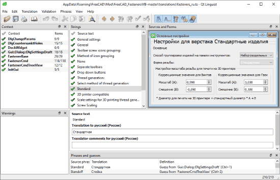
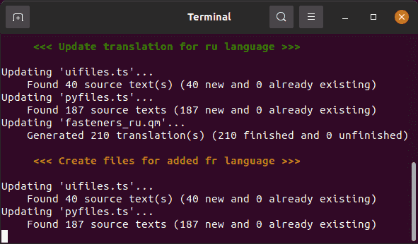

# Workbench translation guide

# Update!
From now on, all translations should be done via Crowdin:  
(https://crowdin.com/project/freecad-addons)

Please do not submit your translations via PR.

## Old system - for reference
### Table of contents:

* [How to make a translation](#how-to-make-a-translation)
* [How to add support for a new language](#how-to-add-support-for-a-new-language)
* [How to update *.ts files after adding changes to workbench code (for developers)](#how-to-update-ts-files-after-adding-changes-to-workbench-code-for-developers)

## How to make a translation

Translations can be performed on operating systems supported by the QT Linguist utility (tested under Windows and Linux)

1. Download and install QT Linguist.
2. Download last workbench repository from github (Code -> Download ZIP).
3. Unpack archive to temporary folder and enter to **/translations** folder.
4. Run QT Linguist application and open the *.ts file to which need to add the translation (by selecting *File → Open*  menu item).

    

5. Translate strings and Don't forget to mark a completed strings as "**✓** Done" 
6. Save the updated *.ts file after completing the partial or full translation.
7. The workbench takes translations from binary *.qm files, *.ts files needs for translators. Make *.qm file by select menu item *File → Release*. 
8. Create a commit that will contain two updated files (*.ts and *.qm) and make a pull request to the FreeCAD_FastenersWB master branch.

## How to add support for a new language

1. Script for adding new languages works only under Linux OS (Script tested in Ubuntu 20.04.2 LTS).
2. Firstly, make sure that the language you want to translate into is supported in the FreeCAD environment. If the language is not supported, then the translation is meaningless (You won't be able to select this language in the settings when it is not supported). To now FreeCAD supports these languages:

            {'English': 'en', 'Afrikaans': 'af', 'Arabic': 'ar', 'Basque': 'eu', 'Bulgarian': 'bg', 
            'Catalan': 'ca', 'Chinese Simplified': 'zh-CN', 'Chinese Traditional': 'zh-TW', 
            'Croatian': 'hr', 'Czech': 'cs', 'Dutch': 'nl', 'Filipino': 'fil', 'Finnish': 'fi', 'French': 'fr', 
            'Galician': 'gl', 'Georgian': 'ka', 'German': 'de', 'Greek': 'el', 'Hungarian': 'hu', 
            'Indonesian': 'id', 'Italian': 'it', 'Japanese': 'ja', 'Kabyle': 'kab', 'Korean': 'ko', 
            'Lithuanian': 'lt', 'Norwegian': 'no', 'Polish': 'pl', 'Portuguese': 'pt-PT', 
            'Portuguese, Brazilian': 'pt-BR', 'Romanian': 'ro', 'Russian': 'ru', 'Slovak': 'sk', 
            'Slovenian': 'sl', 'Spanish': 'es-ES', 'Spanish, Argentina': 'es-AR', 'Swedish': 'sv-SE', 
            'Turkish': 'tr', 'Ukrainian': 'uk', 'Valencian': 'val-ES', 'Vietnamese': 'vi'}
 
    The current (up-to-date) list can be getted from the Python console by following command:

            FreeCADGui.supportedLocales()

3. Install QT5 dev tools packages, by the following terminal commands:

        # sudo apt update
        # sudo apt install qttools5-dev-tools
        # sudo apt install pyqt5-dev-tools

4. Download last workbench repository from github.
5. Enter to **/translations** folder, and open update.sh in Notepad for edit.
6. For example, to add French language find languages variable and add **"fr"** at end of this list. **fr** - is sort language code of French language. Short codes of other languages presented in the second paragraph.

        languages=(es-ar es-es pt-br pt-pt ru fr)

7. Save update.sh
8. Run update.sh as execute file (If run the script in the terminal, more detailed information about the update can be obtained)

    

9. As a result, a new empty *.ts file will be generated to **/translations** folder. Open it in QT Linguist utility and make translations.
10. Save *.ts file after the partial or full translation is completed and close QT Linguist utility.
11. Run the update.sh script again to get a *.qm file.
12. Create a commit that will contain three files *.ts, *.qm and (updated) update.sh script. And make a pull request to the FreeCAD_FastenersWB master branch.

## How to update *.ts files after adding changes to workbench code (for developers)

After changing the code of workbench (make new strings translatable etc.), do the following actions:

1. Install *qttools5-dev-tools* and *pyqt5-dev-tools* packages if it is not installed yet.
2. Enter to **/translations** folder and run update.sh as execute file
3. After executing the script, new strings will be added to all *.ts files whose languages are listed in language variable in the script, *.qm files will also be updated.

